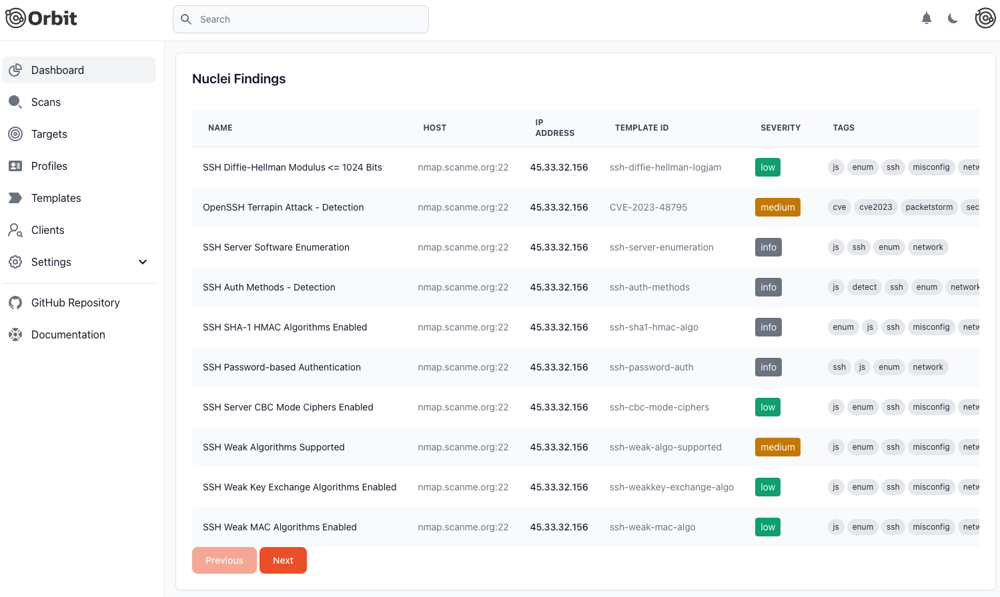

# Orbit Scanner

> ⚠️ **Note**: This software is currently in beta and under heavy development. Features and APIs may change frequently.

Orbit is a powerful platform designed to facilitate large-scale Nuclei scans, enabling teams to efficiently manage and analyze scan results. By integrating modern technologies with a web frontend in SvelteKit and a backend in Go, with Terraform and Ansible for infrastructure and automation, Orbit streamlines the process of running security scans and collaborating on findings.

  

## Features

- **Modern Web Interface**: Built with SvelteKit and Tailwind CSS
- **Robust Backend**: Go-based backend using PocketBase
- **Infrastructure Automation**: Terraform and Ansible integration
- **Multi-Cloud Support**: AWS and DigitalOcean support
- **Notification System**: Email, Slack, Discord, and Telegram integrations
- **Real-time Updates**: WebSocket-based terminal and scan status updates
- **Docker Support**: Easy deployment with Docker containers

## Quick Start

Visit [orbitscanner.io](https://orbitscanner.io) for comprehensive documentation, installation guides, and best practices.

## Development

For development setup and contributing guidelines, please refer to our [Development Guide](https://orbitscanner.io/development).

## License

This project is licensed under the MIT License - see the [LICENSE](LICENSE) file for details.

## Support

- Documentation: [orbitscanner.io](https://orbitscanner.io)
- Issues: [GitHub Issues](https://github.com/orbitscanner/orbit/issues)
- Discussions: [GitHub Discussions](https://github.com/orbitscanner/orbit/discussions)
- Feature Requests: Please submit feature requests through [GitHub Issues](https://github.com/orbitscanner/orbit/issues/new?labels=enhancement&template=feature_request.md)

👀 Don't forget to "Watch" the repository to stay updated with the latest developments!

## Acknowledgments

- [Svelte](https://svelte.dev/)
- [Astro](https://astro.build/)
- [Terraform](https://www.terraform.io/)
- [PocketBase](https://pocketbase.io/)

## Sponsored By

  
  
Proudly sponsored by <a href="https://www.blackhillsinfosec.com/">Black Hills Information Security</a>

For more information, visit the [Orbit GitHub Repository](https://github.com/orbitscanner/orbit).

