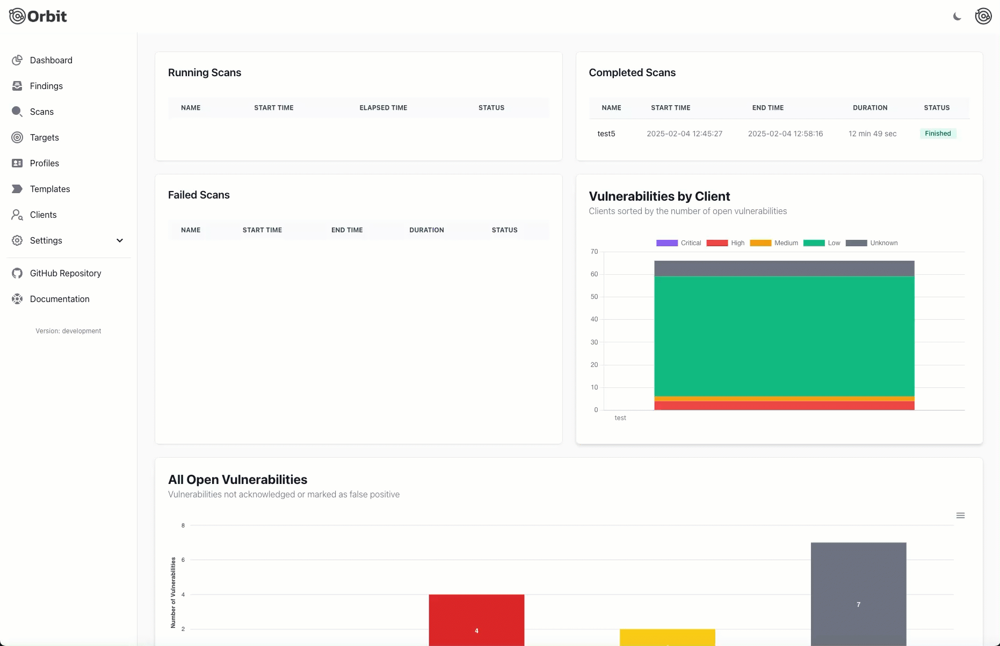

# Bitor Scanner

> 🔄 **Important Notice**: We are rebranding from "Orbit" to "Bitor". This change comes following a cease and desist request from a company claiming rights to the "Orbit" name, despite not holding a registered trademark. While we believe in our right to the name, we've chosen to redirect our resources toward building great software rather than engaging in costly legal proceedings. The functionality and quality of our software remain unchanged - only the name is different.
> 
> ⏳ **Transition Period**: We are in the process of updating all instances of the name across our codebase, documentation, and infrastructure. This transition will take place over the next 30 days. During this time, you may still see references to "Orbit" in various places. We appreciate your patience and understanding during this transition.

> ⚠️ **Note**: This software is currently in beta and under heavy development. Features and APIs may change frequently.

Bitor (formerly Orbit) is a powerful platform designed to facilitate large-scale Nuclei scans, enabling teams to efficiently manage and analyze scan results. By integrating modern technologies with a web frontend in SvelteKit and a backend in Go, with Terraform and Ansible for infrastructure and automation, Bitor streamlines the process of running security scans and collaborating on findings.

  

## Features

- **Modern Web Interface**: Built with SvelteKit and Tailwind CSS
- **Robust Backend**: Go-based backend using PocketBase
- **Infrastructure Automation**: Terraform and Ansible integration
- **Multi-Cloud Support**: AWS and DigitalOcean support
- **Notification System**: Email, Slack, Discord, and Telegram integrations
- **Real-time Updates**: WebSocket-based terminal and scan status updates
- **Docker Support**: Easy deployment with Docker containers

## Quick Start

Visit [bitor.dev](https://bitor.dev) for comprehensive documentation, installation guides, and best practices.

## Development

For development setup and contributing guidelines, please refer to our [Development Guide](https://bitor.dev/development).

## License

This project is licensed under the MIT License - see the [LICENSE](LICENSE) file for details.

## Support

- Documentation: [bitor.dev](https://bitor.dev)
- Issues: [GitHub Issues](https://github.com/orbitscanner/bitor/issues)
- Discussions: [GitHub Discussions](https://github.com/orbitscanner/bitor/discussions)
- Feature Requests: Please submit feature requests through [GitHub Issues](https://github.com/orbitscanner/bitor/issues/new?labels=enhancement&template=feature_request.md)

👀 Don't forget to "Watch" the repository to stay updated with the latest developments!

## Acknowledgments

- [Svelte](https://svelte.dev/)
- [Astro](https://astro.build/)
- [Terraform](https://www.terraform.io/)
- [PocketBase](https://pocketbase.io/)

## Sponsored By

  
  
Proudly sponsored by <a href="https://www.blackhillsinfosec.com/">Black Hills Information Security</a>

## Project Status

Current status of supported providers and features:

### Cloud Providers

| Provider | Status | Notes |
|----------|---------|--------|
| DigitalOcean | ✅ Working | Fully tested and implemented |
| AWS | 🚧 In Progress | Basic implementation, needs testing |
| Azure | 📝 Planned | Not yet implemented |
| GCP | 📝 Planned | Not yet implemented |

### Storage Providers

| Provider | Status | Notes |
|----------|---------|--------|
| S3 Compatible | ✅ Working | Tested with AWS S3 and DigitalOcean Spaces |
| Azure Blob | 📝 Planned | Not yet implemented |
| GCS | 📝 Planned | Not yet implemented |

### Notification Channels

| Channel | Status | Notes |
|----------|---------|--------|
| Jira | ✅ Working | Fully tested and implemented |
| Slack | 📝 Planned | Not yet implemented |
| Discord | 📝 Planned | Not yet implemented |
| Email | 📝 Planned | Not yet implemented |
| Telegram | 📝 Planned | Not yet implemented |

### Discovery Services

| Provider | Status | Notes |
|----------|---------|--------|
| AlienVault | 📝 Planned | Threat intelligence integration |
| BinaryEdge | 📝 Planned | Internet security scanning |
| BufferOver | 📝 Planned | DNS enumeration |
| Censys | 📝 Planned | Attack surface management |
| CertSpotter | 📝 Planned | SSL/TLS monitoring |
| Chaos | 📝 Planned | Project Discovery dataset |
| GitHub | 📝 Planned | Repository scanning |
| IntelX | 📝 Planned | Intelligence data search |
| PassiveTotal | 📝 Planned | RiskIQ integration |
| SecurityTrails | 📝 Planned | Security intelligence |
| Shodan | 📝 Planned | Device search engine |
| VirusTotal | 📝 Planned | File/URL analysis |

### AI Services

| Provider | Status | Notes |
|----------|---------|--------|
| OpenAI | 📝 Planned | GPT-4 and GPT-3.5 integration |
| Anthropic | 📝 Planned | Claude models integration |
| Google AI | 📝 Planned | Gemini models integration |
| Mistral AI | 📝 Planned | Mistral models integration |
| Ollama | 📝 Planned | Self-hosted models |
| Cohere | 📝 Planned | Cohere models integration |

Legend:
- ✅ Working: Fully implemented and tested
- 🚧 In Progress: Partially implemented or under testing
- 📝 Planned: On the roadmap but not yet implemented
- ❌ Not Working: Implemented but currently broken

